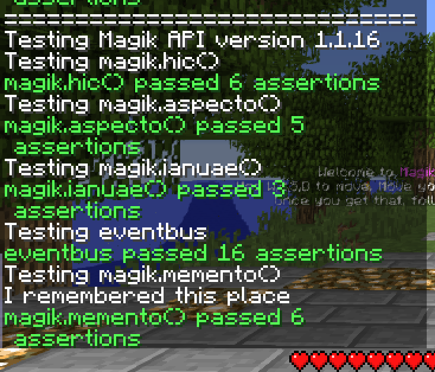

# Issues and Feature Requests

To report an issue or make a feature request, see the [Issues page](https://github.com/Magikcraft/magikcraft-release-notes/issues).

# Magikcraft Release Notes

Magikcraft is the world's number 1 way to learn to code JavaScript in Minecraft.

Check out the [Magikcraft website](https://www.magikcraft.io) and the [Magikcraft YouTube channel](https://www.youtube.com/channel/UC9cEOcTkQEyiKr2nCZDBYeg/videos).

These release notes are updated with new releases. Star this repo to get notifications when it is updated. 

## Friday 25 August

* Version 1.1.19 of the Magikcraft API
* Version 0.10.10 of the Endpoint

1. The Event Store eventing has been refactored to make it cleaner and more modular. Refer to https://github.com/jwulf/play.magikcraft.io-endpoint/blob/develop/src/event-store.ts and https://github.com/jwulf/play.magikcraft.io-endpoint/blob/develop/src/player-events.ts.
2. Player Join and Quit event names have been changed to `PlayerJoinedServer` and `PlayerQuitServer`. 
3. Spell-casting now emits an event: `PlayerCastSpell`.

## Sunday 20 August

* Version 1.1.17 of the Magikcraft API

1. **magik.clearTimeout()**: `magik.clearTimeout()` now cancels a timeout task created with `magik.setTimeout()`. Prior to this release it did not cancel the task. For an example of `magik.setTimeout()` and `magik.clearTimeout()`, see [runTests.js](https://gist.github.com/jwulf/17c6151ee47c7972f3523d84f5f52e78#file-runtests-js-L37).
2. **magik.urlencode**: `magik.urlencode()` URL encodes a string. It is based on [this urlencode code](https://github.com/node-modules/urlencode), with the caveat that only UTF8 is supported in the 1.1.16 release. 
3. **EventEmitter**: The `EventEmitter` class is available in global scope. It is based on [Oliver Caldwall's EventEmitter](https://git.io/ee). Here is an example of using it in your own code:

```
const magik = magikcraft.io;

function eeTest() {
    const e = new EventEmitter();

    e.on('_event', data => {
        magik.dixit(`Event triggered with ${data}`);
    });

    e.emit('_event', 'test data');
}
```
4. **In-game tests for the Magikcraft API**: We've started a suite of tests that run inside Minecraft. You can view them [here](https://gist.github.com/jwulf/17c6151ee47c7972f3523d84f5f52e78#file-runtests-js). They are useful to prevent regressions between releases, and also are a good source of documentation of the API - in addition to the [Magikcraft API Documentation website](http://apidoc.magikcraft.io/modules/magikcraft.io.html) and the [Magikcraft.io typings package](https://github.com/Magikcraft/magikcraft.io).



## Saturday 19 August

* Version 1.0.2 of the [Spellbook App](https://play.magikcraft.io)
* Version 0.10.0 of the Magikcraft Endpoint

### In this release

1. **Gist View**: The 'Gist View' button in the [spellbook](https://play.magikcraft.io) now opens a new browser tab with your Magikcraft spells on GitHub. This allows you to easily copy a link to a specific spell to share with a friend.


2. **Use yarn**: We switched the Magikcraft server from `npm` to use `yarn` instead, to work around [https://github.com/npm/npm/issues/18178](https://github.com/npm/npm/issues/18178#issuecomment-323504516). Packages installed from GitHub repos now reliably update. 

### Known Issues

1. **/magikcraft command**: The `/magikcraft` command in Minecraft reports the version at the time that the server is started, even when the API has been updated during the server's lifetime.

## Thursday 17 August

* Version 1.1.13 of the Magikcraft API 
* Version 0.32 of the Server

To view the current versions of a Magikcraft server, use the command `/magikcraft`.

### In this release:

1. Internal changes to better support dynamic updating of the Magikcraft API. There is no user-visible impact at this time. We're working on a workaround for https://github.com/npm/npm/issues/18178 at the moment.

2. **Eventbus**: The global `eventbus` object, which allows pub/sub communication between JS Engines, is re-enabled. The eventbus can be used to make spells that share player locations (for example, to let you publish your location for others to teleport to you) or shared state like a game score. See the See the [README file for `magikcraft-lore-core`](https://github.com/Magikcraft/magikcraft-lore-core/blob/master/README.md#tojson-and-fromjson) for an example of the eventbus.

3. **JSON Marshalling methods**: `toJSON` and `fromJSON` methods added to the Magikcraft API. These methods marshall a BukkitLocation to and from JSON. See the [README file for the `magikcraft-lore-core`](https://github.com/Magikcraft/magikcraft-lore-core/blob/master/README.md#tojson-and-fromjson) for an example use of these methods.

## Saturday 12 August, 2017

### Enhancement

The [Magikcraft Bar package](http://github.com/magikcraft/magikcraft-lore-ui-bar) is now part of the Magikcraft organisation on GitHub. Create cool interface bars with ease using this package.


## Tuesday 8 August, 2017

### Bugfix: Spell syncing stops working until the GraphQL server is rebooted

**Cause:** EventEmitters were limited on the GraphQL server pub-sub system.

**Consequence:** After a certain number of users connected, spell syncing would stop and you saving spells in the Play App had no effect in Minecraft.

**Fix:** The EventEmitter limit was raised to Infinity!

**Result:** Spell syncing should now work reliably. When you save a spell in the Play App, it should be available immediately in Minecraft for you to cast it.


